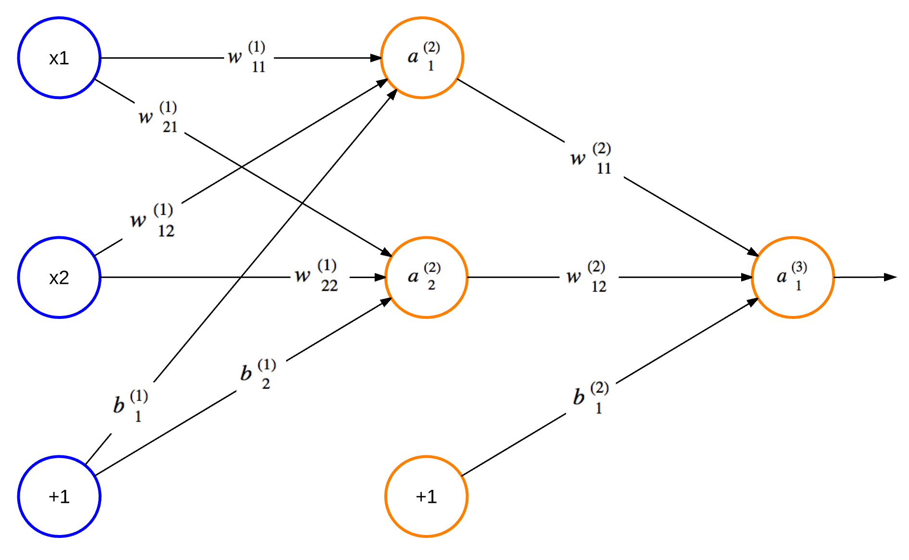

# Optical Character Recognition

Optical Character Recognition (OCR for short) is a piece of software that can take images of
handwritten characters as input and interpret them into machine readable text.

This project is a from-scratch implementation of the OCR system described in
[*500 Lines or Less*, "Optical Character Recognition (OCR)"](https://aosabook.org/en/500L/optical-character-recognition-ocr.html)
by Marina Samuel. It recognises handwritten **digits (0-9)** drawn in the browser, using a
three-layer artificial neural network written without any machine learning framework - just
`numpy` and the backpropagation math done by hand.

## Artificial Neural Networks

ANN for short, is a structure consisting of interconnected nodes that communicate with one
another. The structure and its functionality are inspired by neural networks found in a
biological brain.

Hebbian Theory explains how these networks can learn to identify patterns by physically
altering their structure and link strengths.

Similarly, a standard ANN has connections between nodes that have a weight which is updated as
the network learns. The nodes labelled "+1" are called biases. The leftmost blue column of nodes
are input nodes, the middle column contains hidden nodes, and the rightmost column contains
output nodes. There can be many columns of hidden nodes, known as hidden layers.



## Network design

| Property | Value | Why |
|---|---|---|
| Input nodes | **400** | A 20x20 pixel grid, flattened. Each value is `1` (drawn) or `0` (blank). |
| Hidden nodes | **15** | Chosen empirically - see [Choosing the hidden layer size](#choosing-the-hidden-layer-size). |
| Output nodes | **10** | One per digit, 0-9. The highest-valued output wins. |
| Activation | **Sigmoid**, `1 / (1 + e^-z)` | Saturates toward 0 or 1, and is differentiable - a requirement for backpropagation. |
| Learning rate | **0.1** | Deliberately small: favours accuracy over convergence speed. |
| Weight init | Random in **[-0.06, 0.06]** | Small non-zero values, so nodes don't learn identical features. |

Weights live in two matrices - `theta1` (400 x hidden) and `theta2` (hidden x 10) - plus a bias
vector for each layer. A bias adds a constant to the node's linear input (`y = f(wx + b)`),
shifting the y-intercept and giving the node more flexibility.

Training is the standard four-step backpropagation loop:

1. Initialise weights to small random values.
2. **Forward propagate** - multiply by `theta1`, add the bias, apply sigmoid to get the hidden
   output `y1`; repeat with `theta2` to get the output layer `y2`.
3. **Backpropagate** the error - compare `y2` against the expected label, then push the error
   backward through the hidden layer using the sigmoid derivative.
4. **Update weights** - `weights += learning_rate * (error_matrix * previous_layer_output)`.

After every update the weights are serialised to `nn.json`, and reloaded on startup, so training
progress survives a server restart.

## Architecture

The system is split across a browser client and a Python server:

```
  Browser                          Server (localhost:8000)
+----------------------+         +--------------------------------+
| ocr.html             |         | server.py                      |
|  200x200 canvas      |  POST   |  JSONHandler.do_POST           |
|  Train / Test / Reset| ------> |   |- train   -> nn.train()     |
|                      |  JSON   |   `- predict -> nn.predict()   |
| ocr.js               | <------ |                                |
|  canvas -> 20x20     |         | ocr.py                         |
|  -> 400-item array   |         |  OCRNeuralNetwork (+ nn.json)  |
+----------------------+         +--------------------------------+
```

| File | Role |
|---|---|
| `ocr.html` | The UI: a 200x200 `<canvas>`, a digit input box, and Train / Test / Reset buttons. |
| `ocr.js` | Client logic. Draws on the canvas, translates it to a 20x20 grid, batches training samples, and talks to the server. |
| `server.py` | An HTTP server that accepts JSON POSTs and dispatches to train or predict. |
| `ocr.py` | `OCRNeuralNetwork` - feed forward, backpropagation, prediction, and JSON weight persistence. |
| `neural_network_design.py` | One-off experiment to pick the hidden node count. Not part of the running system. |

### How drawing works

The canvas is 200x200 pixels, but the network only sees 20x20. `ocr.js` treats each network
pixel as a 10x10 block on screen (`TRANSLATED_WIDTH = CANVAS_WIDTH / PIXEL_WIDTH`), so strokes
are chunky enough to be visible while still reducing to 400 inputs. Mouse events map cursor
coordinates to a grid index and call `fillSquare()`, which sets that cell to `1`.

To reduce chatter, the client batches training samples and only POSTs once `BATCH_SIZE` digits
have been drawn.

## API

A single endpoint accepts POSTed JSON. The operation is selected by which flag is present.

**Train** - no response body, `200` on success:

```json
{ "train": true, "trainArray": [ { "y0": [0, 1, 0], "label": 7 } ] }
```

**Predict**:

```json
{ "predict": true, "image": [0, 1, 0] }
```

```json
{ "type": "test", "result": 7 }
```

Status codes: `200` on success, `500` if prediction throws, `400` if neither flag is set. The
handler sends `Access-Control-Allow-Origin: *` so the page can be opened straight from disk.

## Choosing the hidden layer size

Too few hidden nodes and the network can't represent the problem; too many and you pay for
computation you don't need. `neural_network_design.py` settles it experimentally rather than by
guessing:

1. Split the 5000 samples into training and validation sets.
2. For each hidden node count from 5 to 45, in steps of 5, build and train a fresh network.
3. Measure accuracy - the percentage of correctly classified validation samples - averaging over
   100 runs, since random weight initialisation makes any single run noisy.

Sample results from the chapter:

| Hidden nodes | Accuracy |
|---|---|
| 10 | 0.8704 |
| **15** | **0.8808** |
| 20 | 0.8829 |

15 is the sweet spot: a large jump over 10, with diminishing returns above it. Where several
counts perform similarly, prefer the smallest - fewer computations for the same result.

## Dataset

Training uses 5000 pre-labelled digit samples, stored as two plain CSV files loaded with
`np.loadtxt`:

- `data.csv` - 5000 rows x 400 columns of `0`/`1` pixel values.
- `dataLabels.csv` - 5000 rows, one digit label each.

On first startup, if `nn.json` doesn't exist, the network trains on all 5000 samples before
serving requests. Drawing and clicking **Train** in the browser then refines it further.

## Running it

```sh
python server.py          # serves on localhost:8000
```

Then open `ocr.html` in a browser. Draw a digit, type what it is, and hit **Train** - or hit
**Test** to see what the network thinks it is.

To re-run the hidden node experiment:

```sh
python neural_network_design.py
```

Requires `numpy` only. The train/test split is done with `numpy`'s own random number
generator, so `scikit-learn` is not needed.

## Project status

**Python side complete, client side still buggy.** `ocr.py`, `server.py` and
`neural_network_design.py` are implemented and run on Python 3.13 / numpy 2.x. `ocr.js` and
`ocr.html` exist but do not work yet.

Still to do:

- [x] Implement `ocr.py`, `server.py` and `neural_network_design.py`
- [x] Port to **Python 3**. The reference implementation is Python 2: `BaseHTTPServer` is now
      `http.server`, `print` is a function, and `xrange` is `range`. `numpy.mat` was also
      removed in numpy 2.0, so the reference implementation's matrix code no longer runs.
- [ ] Fix `ocr.js` - undefined `HOST`, `PORT`, `BATCH_SIZE`, `trainArray` and
      `trainingRequestCount`; missing `onLoadFunction` and `resetCanvas`; typos in
      `getELementById` and `trainingRequestCont`
- [ ] Fix `ocr.html` - `<scrip scr=>` should be `<script src=>`, and stray quotes in the
      `link` and `canvas` attributes
- [ ] Add `data.csv` and `dataLabels.csv` (not yet in this repo)
- [ ] Add `ocr.css` - `ocr.html` references it in the original

## Credits

Based on the OCR chapter of [*500 Lines or Less*](https://aosabook.org/en/500L/) by Marina
Samuel, part of *The Architecture of Open Source Applications*. The reference implementation
lives at [aosabook/500lines/ocr](https://github.com/aosabook/500lines/tree/master/ocr).
